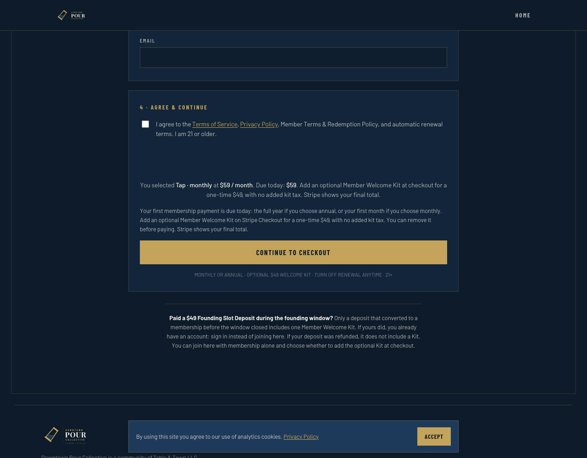
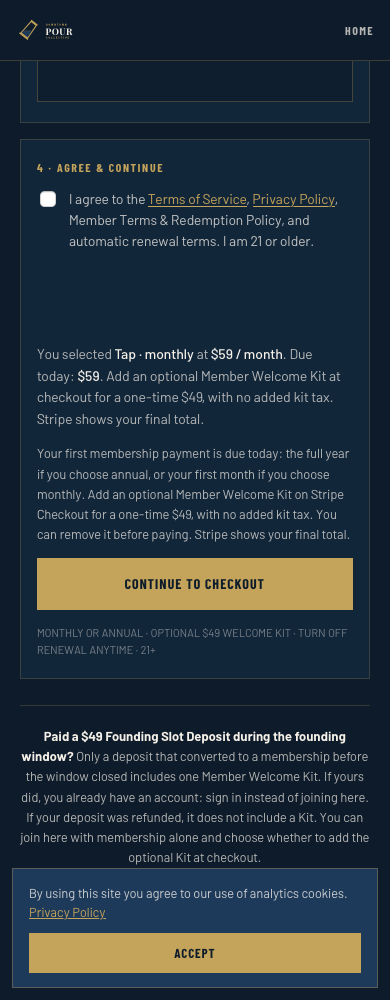
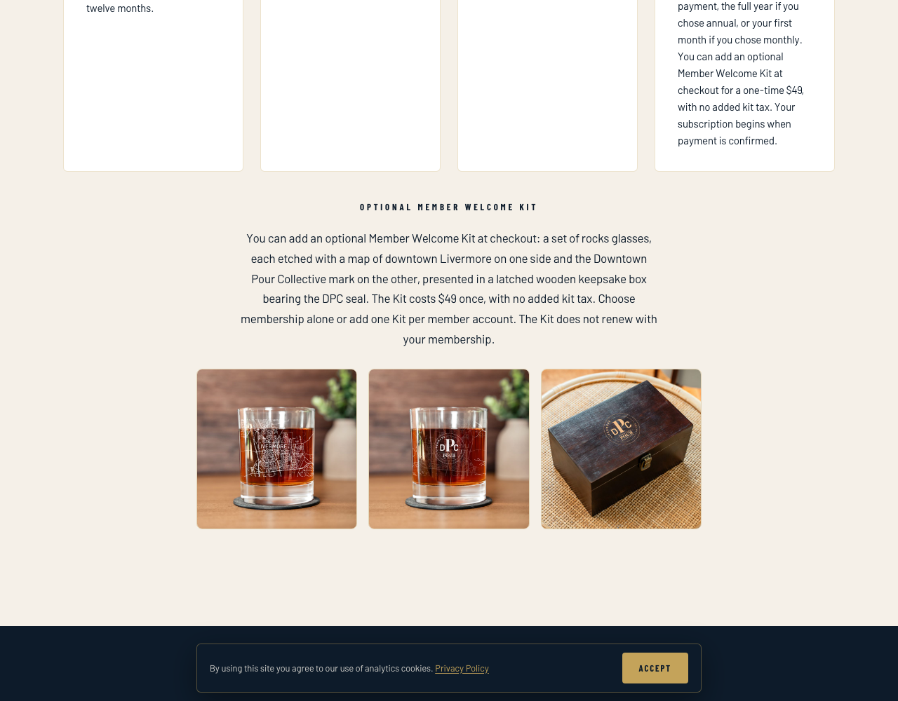

# Optional Welcome Kit: website review and coordinated activation

This is a release preparation record, not authorization to change production.
Brandi approved membership-only checkout by default and an optional one-time $49
non-taxable Member Welcome Kit. DPC backend PR [#415](https://github.com/CrownLabs-LLC/DPC/pull/415)
merged as `c32fb9607791ada52193bbb7fb24974c426325e0`. Its production kit Price
constant remains null and optional-kit flag remains false. A website PR may be
reviewed now, but **its merge must wait for the coordinated release gate**.

The original catalog investigation and local verification below are dated
preparation records. See the PR #55 follow-up at the end for the completed live
catalog action, CI failures, responsive repair and current release holds.

## Why the website merge is a release action

[README](../README.md#deployment) and [DEPLOY](../DEPLOY.md#5-vercel--git-integrated-deploy)
state that merging DPC-WEB to `main` automatically publishes through Vercel's Git
integration. There is no safe interval in which optional-kit copy can be merged
while production checkout still charges the mandatory setup fee. PR preview is
for review only; do not run `vercel --prod` locally.

The website branch starts at `b56dc6b78b31c32b4da173c58f30ef84f88385f8`, preserving
signup recovery #54 and privacy controls #53. It changes home/join disclosures,
FAQ structured data, and default totals, and recalculates totals when browser
history restores selections. Existing routes, signup submission contracts, legal
version reads/re-acceptance, and `ADVERTISING_ENABLED=false` are preserved.
Success and cancellation pages make no kit entitlement promise and remain
unchanged. Founding-deposit terms and the private historical conversion page
remain unchanged; the public deposit footnote preserves converted-deposit kit
eligibility and does not grant a kit for a refunded deposit. No accepted legal
version is silently changed.

## Read-only production catalog finding

At 22:17:51 UTC on September 16, 2026, the Stripe connector identified Downtown Pour Collective
account `acct_1Te5hWCtQ9S99QuE`, live mode. Complete reads of `GET /v1/products`
and `GET /v1/prices` returned 7 products and 18 prices, both with `has_more=false`.
There is **no dedicated optional Member Welcome Kit Product/Price**.

The historical Member Setup Fee is Product `prod_VBNf7l5J5gGeR5`, default Price
`price_1UB0uPCtQ9S99QuEqd0wKMrv`, one-time USD 4900, tax behavior `unspecified`,
and Product tax code null. Preserve it unchanged for historical contracts.
The old Founding Slot Deposit is also distinct and must not be reused. The
read-only tax-code response confirms `txcd_00000000` is **Nontaxable**.
No catalog objects, tax settings, registrations, subscriptions, or payments were
changed during this investigation.

### Exact catalog action awaiting approval

Create one dedicated Product with its default one-time Price, using the intended
live account and the existing pinned Stripe API version. The proposed
`POST /v1/products` body is:

```json
{
  "name": "Member Welcome Kit",
  "description": "Optional Member Welcome Kit: two etched rocks glasses in a wooden keepsake box. One-time purchase; does not renew with membership.",
  "active": true,
  "tax_code": "txcd_00000000",
  "metadata": { "dpc_product_type": "member_welcome_kit" },
  "default_price_data": {
    "currency": "usd",
    "unit_amount": 4900,
    "tax_behavior": "inclusive"
  }
}
```

Omitting `recurring` creates a one-time Price; inclusive behavior keeps the
advertised total fixed, while the Nontaxable Product code specifies zero kit tax.
This changes no membership, other-product, account-wide tax, or registration
settings. Use one idempotency key for the approved create attempt; an ambiguous
response must be reconciled before retrying. Read back `livemode=true`, Product
name/code, and the returned Price's Product binding, `currency=usd`,
`unit_amount=4900`, `type=one_time`, `recurring=null`, and `tax_behavior=inclusive`.
Record the actual returned Price ID; do not invent it from another account.
Official references: [create Product](https://docs.stripe.com/api/products/create),
[Product tax treatment](https://docs.stripe.com/tax/zero-tax).

Catalog-only approval does not authorize deployment, checkout activation, a new
production payment, or the website merge. The actual returned Price ID is needed
before the exact-ID follow-up migration and runtime patch can be finalized.

## Backend preparation required before website activation

Start a new DPC slice from then-current `main`. Generate a new migration through
the repository's migration workflow, preserving the already-applied migration
and all intent/evidence history. The migration must widen these three existing
allowlists to retain the sandbox Price and add the verified production Price:

| Location | Required change |
| --- | --- |
| `checkout_intents.stripe_welcome_kit_price_id` CHECK | Accept both exact IDs; preserve nullable offer semantics |
| `member_welcome_kit_purchases.stripe_price_id` CHECK | Accept both exact IDs; preserve non-null and amount/currency/quantity checks |
| `prepare_checkout_purchase_contract` | Accept either exact Price, and continue rejecting null or unknown Price |

The preparation RPC predicate must include an explicit null check:

```sql
if p_stripe_welcome_kit_price_id is null
  or p_stripe_welcome_kit_price_id not in (
    'price_1UGMG5E1z3Q3TJr7TWJ3xl7O', '__VERIFIED_PRODUCTION_KIT_PRICE__'
  ) then
  raise exception 'checkout_welcome_kit_price_not_allowed' using errcode = 'P0001';
end if;
```

`__VERIFIED_PRODUCTION_KIT_PRICE__` is an unbound preparation marker, never a
deployable identifier. Preserve the remainder of the preparation function.
`record_circle_checkout_initial_payment_with_kit` has no second hardcoded Price:
it must continue binding the paid Price to the frozen intent Price, with exact
USD 4900/quantity-one checks. Do not weaken that validation or alter legacy
backfill to accommodate the catalog.

Set `STRIPE_MEMBER_WELCOME_KIT_PRICE_IDS.production` to the read-back live Price
in `src/modules/billing/internal/circleCheckout.ts`. Keep
`PRODUCTION_OPTIONAL_WELCOME_KIT_ENABLED=false` during preparation and deployment.
The Price allowlist is bundled into both the shared `stripe-webhook` and
`circle-checkout`; both must be built from the reviewed revision and verified
remotely. Apply the schema before those runtime bundles. Preserve Finance routing,
signatures, existing subscriptions, and the dedicated staging ingress.

The DPC slice needs its own TypeScript, full unit, fresh DB and whitespace gates,
module-boundary check, review, PR-opening approval, and merge. DB coverage must
prove both allowlisted Prices, null/unknown rejection, frozen-price mismatch
rejection, and unchanged legacy/skip/purchase idempotency. Website tests cannot
stand in for these backend gates.

## Production proof and cutover sequence

1. Before any release action, record exact backend and website revisions,
   production account/project identities, the approved catalog readback, and
   rollout/rollback owners. The production Supabase target is
   `ebiuspbgzggrdiaswpcc`; the staging target must not be substituted.
2. Under separate deployment approval, apply the compatible schema and deploy
   the reviewed shared webhook and checkout bundles with the optional flag off.
   Record function versions and source manifests. Legacy sessions keep their
   original contracts and continue finalizing normally.
3. Require the first approved legacy-session finalization, or an approved Stripe
   redelivery of an original signed production member event, through the shared
   production `stripe-webhook`. Capture actual provider HTTP 200 and the expected
   durable finalization/idempotent evidence; replay must not duplicate payments,
   kit/fee records, activation, or onboarding. The dedicated staging ingress
   cannot prove this shared-entrypoint delivery. Do not manufacture signed
   events. If there is no approved event, optional activation waits.
4. Obtain the coordinated activation/website-merge approval. Pause **new public
   checkout creation** using `PRODUCTION_CIRCLE_CHECKOUT_ENABLED=false`, and
   verify `CHECKOUT_NOT_ENABLED`; leave payment webhooks and in-flight legacy
   sessions operational. This creates a controlled cutover window.
5. Merge the approved website PR, then verify Vercel's production deployment is
   for that exact merge revision. Verify home, join, FAQ data, all six totals,
   cancellation links and privacy controls while new checkout remains paused.
   Browser caches must not continue serving mandatory-fee copy as the new policy
   becomes available.
6. Deploy the approved checkout revision with the optional-kit flag true, keeping
   new checkout paused until both website and runtime readbacks match. Re-enable
   new public checkout creation only after all preceding gates pass. Confirm a
   new session is membership-only by default and offers one removable $49 kit;
   do not initiate an additional production payment without explicit approval.
7. Observe real approved/organic outcomes through normal payment and kit
   reconciliation. Required missing-decision, conflict, and stale-payment counts
   remain zero. Keep original session policy/evidence and existing entitlement
   sources intact.

| Circle | Monthly membership only / with kit | Annual membership only / with kit |
| --- | --- | --- |
| Tap | $59 / $108 | $590 / $639 |
| Cellar | $69 / $118 | $690 / $739 |
| Reserve | $79 / $128 | $790 / $839 |

The kit adds $49 once with no added kit tax. Renewal is the selected membership
charge only. The website displays the membership-only column; Stripe displays
any member-selected kit addition.

## Rollback

Pause new public checkout creation first; preserve the compatible schema,
kit-aware event processing, all in-flight session contracts, and durable payment,
kit, membership, onboarding, and audit evidence. Do not drop the migration,
archive a Price needed by existing sessions, rotate Finance secrets, or disable
webhooks. Restoring mandatory-fee checkout requires its matching reviewed website
copy under the same controlled pause; toggling only the optional flag is not a
complete rollback. Verify every restored revision before reopening signup.

## Verification scope

Website validation uses offline endpoint/static tests and mocked browser handoff
on desktop Chromium, mobile Chromium and mobile WebKit. It covers all Circles
and both intervals, changes of selection, browser back/cancel, 320px/1280px copy,
legal-version recovery/re-acceptance, and privacy/GPC/advertising-disabled flows.
Browser mocks do not claim a real Stripe payment or new production proof.
The backend's completed real sandbox paid proof is retained in
[DPC's operations runbook](https://github.com/CrownLabs-LLC/DPC/blob/main/docs/optional-welcome-kit-operations.md#staging-proof--september-16-2026).

This website slice changes no API, DB schema, or legal-version records. Therefore
DPC TypeScript/DB gates are not applicable here; they remain mandatory for the
future backend activation slice. Physical-device/Vercel preview checks, where
required by the deployment checklist, are release evidence to collect after the
website PR is approved for opening; emulation is not a physical-device claim.

## Historical website verification at `0133785` — September 16, 2026

- `npm test`: PASS, all nine configured offline suites, including signup
  diagnostics, legal versions, release readiness and privacy controls.
- Checkout/optional-kit/legal-recovery/privacy Playwright selection: **153 passed**
  across desktop Chromium, mobile Chromium and mobile WebKit. Requests to the
  checkout provider are mocked; there were no new Stripe payments.
- `git diff --check`: PASS. No cross-module imports or backend paths changed.
- Visual review: desktop and mobile copy remains readable with the cookie
  notice present; 320px and 1280px geometry checks passed. The optional heading,
  membership-only total, kit price/removal explanation and historical deposit
  note are present. Browser checks retain privacy controls and disabled ads.
- The first targeted run passed 31/33; Chromium back navigation exposed an empty
  total after native form restoration. The `pageshow` recalculation fixes it;
  both Chromium variants and WebKit passed the subsequent full relevant run.
- The design detector returned no regex findings but reported missing parser
  dependencies; it did not measure computed contrast. CSS was unchanged at this
  revision; the subsequent responsive repair changes renewal-note wrapping.
- GitHub CI had not run when this local record was prepared. The existing website workflow
  runs offline and browser checks when a PR is opened. Physical-device/Vercel
  preview and production gates above remain release work, not claimed passes.

Screenshots from local QA, with production requests blocked and no member data:

| Signup, desktop | Signup, mobile |
| --- | --- |
|  |  |



Source evidence SHA-256 (full sanitized outputs accompany the PR):

| Evidence | SHA-256 |
| --- | --- |
| Offline test output | `e267b049f641668b825aa8237c93202489d7d4a10e5bc8b5703b9ac7fc1ac9cb` |
| Browser regression output | `155e64c532c88b8fd512fececea7f49d6d498fb645ca4d2408adf324f77fc032` |
| Read-only production catalog snapshot | `6dfebdeb631737a28bd6c9b564cd94d716b17d2dbbd9fd9a31d2c3a218b7ca9b` |

## PR #55 CI follow-up and responsive repair — September 16, 2026

[Website PR #55](https://github.com/CrownLabs-LLC/DPC-WEB/pull/55) was opened with
Brandi's approval and remains **HOLD MERGE**. The prior Vercel preview succeeded;
it does not establish hosted-flow or physical-device validation.

The coordinator created and independently verified live Product
`prod_VGzmS9ohrhuXc2` and Price `price_1UGRnCCtQ9S99QuEA7IcpJzM` at 22:59 UTC:
active/live, one-time USD4900, inclusive behavior, Nontaxable
`txcd_00000000`, correct Product binding, and no recurring component. The
historical Setup Fee Product was unchanged. Creation used the Stripe connector
after approved permission reconsent; its response did not expose the creation API
version, so no CLI version pin is claimed. The backend Price follow-up at
`150300d03c96ca08a89c9fc12d9f4a2be610fff6` and its frozen P/A/B source artifacts
passed independent review but still require their normal opening, merge and
deployment gates. Optional production creation remains off.

CI history at the original website head `0133785` is preserved:

- Attempt 1 failed an unchanged health-check timing assertion: 3999ms versus a
  4000ms minimum. This remains a separate deterministic-test hardening item.
- [Attempt 2](https://github.com/CrownLabs-LLC/DPC-WEB/actions/runs/35161478202/attempts/2)
  passed offline checks but finished **194 browser passes / 1 failure**, including
  a failed retry. At 320px, clicking Annual timed out while the header, cookie
  notice and interval card intercepted the automatic click/scroll sequence.
- Trace inspection showed a 326px mobile layout inside the configured 320px
  viewport. A wider-font reproduction isolated overflow to the billing cards;
  ordinary clicks could fail even after centering their labels. The non-wrapping
  renewal note imposed an excessive minimum grid width.

The product repair changes only `.interval-opt__note` from `white-space: nowrap`
to `normal`. The note can wrap when space is limited and stays on one line when
space permits. The tests click the visible associated labels, assert their radio
states, switch Monthly to Annual at 320px, and check document/card as well as
disclosure bounds. The cookie notice stays visible and consent stays unset.
Click actionability, timeouts, privacy behavior and larger-layout structure are
preserved.

Repair verification:

| Check | Result |
| --- | --- |
| New regression against old CSS | Expected failure: document width 365px in a 320px viewport |
| Repaired geometry/interaction cases | 9 passed across desktop Chromium, mobile Chromium and mobile WebKit |
| Full browser suite with CI settings and retries disabled | 198 passed |
| `npm test` | All nine offline suites passed |
| `git diff --check` | Passed |
| Visual/geometry probe with wider text | Document 320px, no horizontal overflow; normal switching with cookie visible and consent unset |

These are local results for the repair. Earlier 153-case results and screenshots
belong to the historical head above. New-head independent clearance, GitHub CI
and preview readback remain necessary before considering merge. Backend scoped
deployment, actual signed shared-webhook proof, the approved paused/open source
artifacts, hosted-flow/device evidence, and coordinated website/backend cutover
remain release gates. No production payment, merge or deployment is authorized
by this addendum.
